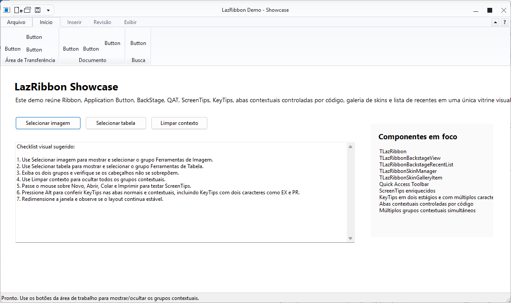
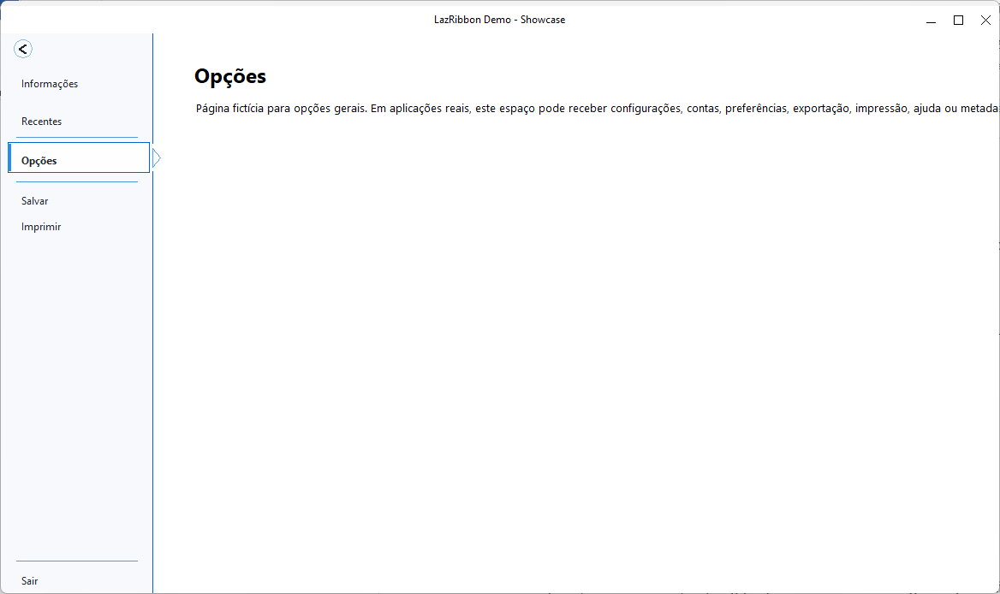
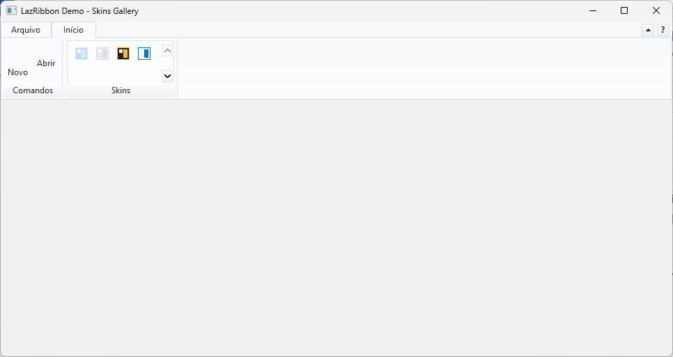
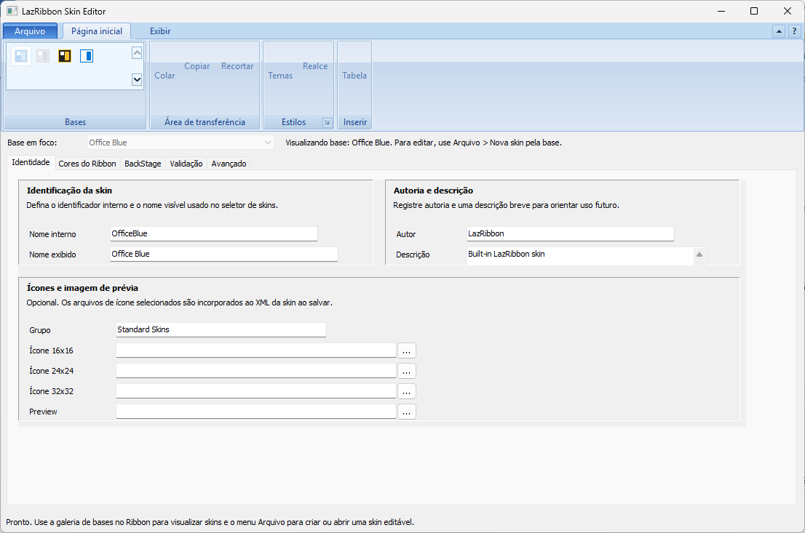

# LazRibbon Manual

Target: LazRibbon 2.1.1, Lazarus 4.8.

This manual explains how to install the package, how the components connect to
each other, and which published properties and events are part of the public
surface. The exact generated Object Inspector source of truth remains
`docs/quality/OBJECT_INSPECTOR_SURFACE_SNAPSHOT_2_0.md`; this manual turns that
surface into a usage guide.

For property-by-property and event-by-event explanations, use
`docs/manual/LAZRIBBON_COMPONENT_REFERENCE.md`.

## Figures

Main Ribbon showcase:



BackStage covering the application client area:



Skin Gallery / skin selection workflow:



Standalone Skin Editor:



## 1. Installation

1. Extract the release ZIP into a normal project folder.
2. Open Lazarus 4.8.
3. Install the runtime package first:
   `packages/LazRibbonRuntime.lpk`.
4. Install the design-time package next:
   `packages/LazRibbonDesign.lpk`.
5. Rebuild Lazarus when the IDE asks.
6. After restart, the `LazRibbon` palette page should show:
   `TLazRibbon`, `TLazRibbonPopupMenu`, `TLazRibbonBackstageView`,
   `TLazRibbonBackstagePage`, `TLazRibbonBackstageRecentList`,
   `TLazRibbonSkinManager` and `TLazRibbonSkinSelector`.

Recommended validation command before distributing or reinstalling from source:

```powershell
powershell -ExecutionPolicy Bypass -File tools\verify_release_candidate.ps1 -Version 2.1.1 -ReleaseVersion 2.1.1 -OutputDirectory D:\Ribbon4Lazarus\Releases
```

## 2. Component Model

LazRibbon is composed as an object graph:

- A form hosts one `TLazRibbon`, usually aligned to `alTop`.
- `TLazRibbon.Tabs` contains `TLazRibbonTab` entries.
- Each tab contains `TLazRibbonPane` groups.
- Each pane contains command items: buttons, separators, checkboxes, hosted
  controls, galleries and skin galleries.
- `TLazRibbon.BackstageView` links the Ribbon to an Office-like BackStage.
- `TLazRibbon.QuickAccessToolBar` owns the Quick Access Toolbar items.
- `TLazRibbonSkinManager` owns skin definitions and can feed the Ribbon,
  BackStage, recent lists and skin selectors.

Palette components are dropped directly on a form. No-icon item classes are
created through the Ribbon designer, pane item editors or collections.

## 3. First Ribbon

The smallest useful setup is:

1. Drop `TLazRibbon` on the form and keep `Align = alTop`.
2. Create a tab in `Tabs`.
3. Create a pane in the tab's `Panes`.
4. Add a `TLazRibbonLargeButton` or `TLazRibbonSmallButton` to the pane.
5. Set `Caption`, `ImageIndex` or `LargeImageIndex`, `KeyTip` and `OnClick`.

Use `Images` and `LargeImages` on `TLazRibbon` for shared command icons. Standard
`Action` objects can be assigned to Ribbon buttons and Quick Access items.

## 4. BackStage Setup

1. Drop `TLazRibbonBackstageView` on the form.
2. Assign it to `TLazRibbon.BackstageView`.
3. Set `TLazRibbonBackstageView.LinkedToolbar` to the Ribbon.
4. Add `TLazRibbonBackstagePage` controls for content pages.
5. Use `TLazRibbonBackstageView.Buttons` to create page links, commands and
   separators.
6. Use `OverlayMode = bomCoverClientArea` for the modern Office-like mode.

BackStage pages are content containers. New projects should not treat
`TLazRibbonBackstagePage` as the command/navigation model; use
`TLazRibbonBackstageView.Buttons` for that.

## 5. Skin Setup

1. Drop `TLazRibbonSkinManager` on the form.
2. Set `SkinFolder` if external `.skin` files should be loaded. The normal
   default is `.\Skins`; if that folder does not exist, the application folder
   is also considered by the loading workflow.
3. Set `ActiveSkinName`.
4. Assign the manager to `TLazRibbon.SkinManager`.
5. Set `TLazRibbon.AppearanceSource = asSkinManager`.
6. Assign the same manager to BackStage, recent lists and skin selectors when
   they should share the active skin.

Use `TLazRibbonSkinSelector` as a standalone selector or
`TLazRibbonSkinGalleryItem` inside a Ribbon pane.

## 6. KeyTips And ScreenTips

`TLazRibbon.ShowKeyTips` enables staged keyboard hints. Set `KeyTip` on tabs,
buttons, pane items, the Application Button and Quick Access items.

ScreenTips use these common item properties:

- `ShowScreenTip`
- `ScreenTipTitle`
- `ScreenTipText`
- `ScreenTipShortcut`
- `ScreenTipFooter`

If no custom ScreenTip is set, the normal `Hint` can still be used.

## 7. Component Reference

The summary below focuses on the published API that a developer configures in
the Object Inspector or through code. The complete property/event explanations
are in `docs/manual/LAZRIBBON_COMPONENT_REFERENCE.md`.

### TLazRibbonForm

Role: form shell with optional custom Ribbon title bar.

Properties: `Ribbon`, `SkinManager`, `UseCustomTitleBar`, `TitleBarHeight`,
`ShowSystemButtons`, `ShowTitleIcon`, `TitleIcon`, `TitleAlignment`.

Events: standard `TForm` events inherited from Lazarus.

### TLazRibbon

Role: main Ribbon root.

Connection properties: `ApplicationButton`, `QuickAccessToolBar`,
`BackstageView`, `SkinManager`, `Images`, `DisabledImages`, `LargeImages`,
`DisabledLargeImages`.

Behavior and visual properties: `RibbonMinimized`,
`ShowMinimizeRibbonButton`, `MinimizeRibbonHint`, `RestoreRibbonHint`,
`ShowHelpButton`, `ShowKeyTips`, `ShowContextualGroupHeaders`,
`ContextualGroupHeaderHeight`, `TabCaptionHorizontalPadding`,
`TabCaptionSpacing`, `MinTabCaptionWidth`, `HelpButtonHint`, `Color`, `Style`,
`AppearanceSource`, `RibbonAppearance`, `TabIndex`, `ImagesWidth`,
`LargeImagesWidth`, `Align`, `BiDiMode`, `BorderSpacing`, `Anchors`, `Hint`,
`ParentShowHint`, `ShowHint`, `Visible`.

Events: `OnHelpButtonClick`, `OnRibbonMinimizedChanged`, `OnTabChanging`,
`OnTabChanged`, `OnResize`, `OnShowHint`.

### TLazRibbonApplicationButton

Role: Office File/Application button.

Properties: `Caption`, `Visible`, `Mode`, `Style`, `Menu`, `Glyph`,
`ImageIndex`, `Hint`, `KeyTip`, `ShowScreenTip`, `ScreenTipTitle`,
`ScreenTipText`, `ScreenTipShortcut`, `ScreenTipFooter`.

Events: `OnClick`.

Use `Mode` to decide whether the button fires an event or opens a menu. New
BackStage projects should link BackStage through `TLazRibbon.BackstageView`.

### TLazRibbonQuickAccessToolBar

Role: Quick Access Toolbar configuration object owned by `TLazRibbon`.

Properties: `Visible`, `Position`, `Items`, `ButtonFrameStyle`, `ButtonSize`,
`Spacing`, `FallbackGlyphStyle`, `CustomizeActionList`, `CustomizeMenuTitle`,
`MoreCommandsCaption`, `StorageSection`, `ShowCustomizeButton`,
`ShowMoreCommandsItem`, `ShowPositionMenuItem`,
`ShowMinimizeRibbonMenuItem`, `ShowResetToDefaultsItem`, `AllowCustomizing`,
`AllowQuickCustomizing`, `AllowReset`, `AllowPositionChange`,
`AllowMinimizeRibbon`, `Images`, `ShowAboveRibbonCaption`,
`ShowBelowRibbonCaption`, `MinimizeRibbonCaption`, `RestoreRibbonCaption`,
`ResetToDefaultsCaption`.

Events: `OnCustomizeClick`, `OnMoreCommandsClick`.

### TLazRibbonQuickAccessItem

Role: one command in the Quick Access Toolbar.

Properties: `Caption`, `Action`, `LinkedItem`, `ImageIndex`, `Enabled`,
`Visible`, `Hint`, `KeyTip`, `ShowScreenTip`, `ScreenTipTitle`,
`ScreenTipText`, `ScreenTipShortcut`, `ScreenTipFooter`.

Events: inherited action/click behavior through `Action` or linked item.

### TLazRibbonPopupMenu

Role: owner-drawn popup menu that can share Ribbon appearance.

Properties: `Appearance`, plus inherited `TPopupMenu` properties.

Events: inherited `TPopupMenu` events.

### TLazRibbonTab

Role: Ribbon page.

Properties: `CustomAppearance`, `Caption`, `KeyTip`, `Contextual`,
`ContextualGroupCaption`, `ContextualColor`, `OverrideAppearance`, `Visible`.

Events: `OnClick`.

### TLazRibbonPane

Role: group inside a tab.

Properties: `Caption`, `Visible`, `DialogLauncherStyle`,
`ShowDialogLauncher`.

Events: `OnDialogLauncherClick`.

Use `ShowDialogLauncher` for the small Office-style launcher button in the pane
caption band.

### Common Pane Item Properties

The pane item classes inherit these common properties from `TLazRibbonBaseItem`:

`Visible`, `Enabled`, `Hint`, `KeyTip`, `ShowScreenTip`, `ScreenTipTitle`,
`ScreenTipText`, `ScreenTipShortcut`, `ScreenTipFooter`.

Button-like items also inherit from `TLazRibbonBaseButton`:

`Action`, `Caption`, `Checked`, `OnClick`.

### TLazRibbonLargeButton

Role: large command button in a pane.

Properties: common pane item properties, common button properties,
`AllowAllUp`, `ButtonKind`, `DropdownMenu`, `GroupIndex`, `LargeImageIndex`.

Events: `OnClick`.

### TLazRibbonSmallButton

Role: compact command button in a pane row/table.

Properties: common pane item properties, common button properties,
`GroupBehaviour`, `HideFrameWhenIdle`, `ImageIndex`, `ShowCaption`,
`TableBehaviour`, `AllowAllUp`, `ButtonKind`, `DropdownMenu`, `GroupIndex`.

Events: `OnClick`.

### TLazRibbonSeparator

Role: structural separator between pane items.

Properties: no normal command properties should be edited in new forms. The
design package hides inherited command and ScreenTip properties because the item
does not execute actions.

Events: none for normal use.

### TLazRibbonCheckbox

Role: checkable pane item.

Properties: common pane item properties, common button properties, `Checked`,
`TableBehaviour`, `State`.

Events: `OnClick`.

### TLazRibbonRadioButton

Role: mutually exclusive pane item.

Properties: common pane item properties, common button properties,
`AllowAllUp`, `GroupIndex`, `State`, `TableBehaviour`.

Events: `OnClick`.

### TLazRibbonToggleSwitch

Role: switch-style toggle pane item.

Properties: common pane item properties, common button properties,
`AllowAllUp`, `GroupIndex`, `Checked`, `TableBehaviour`.

Events: `OnClick`.

### TLazRibbonCustomRibbonExtItem

Role: base class for extended pane items.

Properties: `Caption`, `DisplayMode`, `ImageIndex`, `LargeImageIndex`,
`Width`.

Events: `OnClick`.

### TLazRibbonControlHostItem

Role: hosts a real Lazarus control inside a Ribbon pane.

Properties: common extended item properties, `Control`.

Events: `OnClick` from the inherited extended item when applicable.

Use `Control` for new projects. Legacy `ControlName` and `ControlClassName`
exist only for old resources/source compatibility and are hidden at design time.

### TLazRibbonGalleryItem

Role: generic gallery/grid item.

Properties: common extended item properties, `Columns`, `ItemWidth`,
`ItemHeight`, `PopupMode`, `PopupWidth`, `PopupHeight`.

Events: inherited `OnClick`.

### TLazRibbonSkinGalleryItem

Role: Ribbon pane gallery for choosing skins.

Properties: common extended item properties, gallery layout properties,
`SkinManager`, `SelectedSkinName`, `ShowHints`, `IconWidth`, `IconHeight`,
`MaxVisibleItems`, `VisibleStartIndex`, `OverflowMode`.

Events: `OnSkinSelected`, inherited `OnClick`.

Use `SelectedSkinName` instead of the compatibility-only `SelectedSkin`.

### TLazRibbonBackstageView

Role: Office-like BackStage overlay.

Properties: `ActivePageIndex`, `AppearanceSource`, `BackstageTabCaption`,
`BackButtonHint`, `BackButtonStyle`, `BackButtonVisible`, `Buttons`, `Align`,
`Anchors`, `AutoHideAtRuntime`, `BorderSpacing`, `Color`, `CloseOnEscape`,
`CloseOnRibbonTabClick`, `Constraints`, `Enabled`, `Font`, `HeaderHeight`,
`Images`, `LargeImages`, `ItemHeight`, `LinkedToolbar`, `NavigationStyle`,
`PageButtonVisualMode`, `NavigationWidth`, `OpenOnTabCaption`, `OverlayMode`,
`ParentFont`, `ParentShowHint`, `PopupMenu`, `ShowHint`, `SkinManager`,
`Style`, `Title`, `Visible`.

Events: `OnClick`, `OnClose`, `OnClosed`, `OnPageChanged`, `OnResize`.

### TLazRibbonBackstageButton

Role: item inside `TLazRibbonBackstageView.Buttons`.

Properties: `Action`, `BeginGroup`, `Caption`, `CloseBackstageOnClick`,
`Enabled`, `Hint`, `ImageIndex`, `LargeImageIndex`, `Kind`, `LinkedItem`,
`Section`, `Page`, `Visible`.

Events: `OnExecute`.

### TLazRibbonBackstagePage

Role: BackStage content page.

Properties: `Caption`, `Align`, `Anchors`, `BorderSpacing`, `Color`,
`Constraints`, `Enabled`, `Font`, `ParentColor`, `ParentFont`,
`ParentShowHint`, `PopupMenu`, `ShowHint`, `Visible`.

Events: inherited control events.

Command/navigation properties are intentionally not part of the normal design
surface; use `TLazRibbonBackstageView.Buttons`.

### TLazRibbonBackstageRecentList

Role: recent-file/document list for BackStage pages.

Properties: `Align`, `Anchors`, `BorderSpacing`, `Color`, `Constraints`,
`Enabled`, `Font`, `AppearanceSource`, `ImageIndex`, `Images`, `ItemHeight`,
`Items`, `MaxRecentItems`, `ParentColor`, `ParentFont`, `ParentShowHint`,
`PopupMenu`, `SelectedIndex`, `SelectionStyle`, `ScrollBarMode`,
`ScrollBarWidth`, `SkinManager`, `StorageSection`, `ShowHint`, `Visible`.

Events: `OnItemClick`.

### TLazRibbonSkinManager

Role: skin repository, active skin source and shared appearance model.

Properties: `ActiveSkinName`, `SkinFolder`, `AutoRefreshControls`,
`Appearance`, `General`, `Accent`, `Backstage`, `RecentList`, `Ribbon`.

Events: `OnChange`.

`ActiveSkinName` is the canonical selector because it can address built-in and
external skins. `ActiveSkin` remains only as source/legacy compatibility.

### TLazRibbonSkinDefinition

Role: serializable skin identity and visual definition.

Properties: `Name`, `DisplayName`, `GroupName`, `Author`, `Description`,
`Notes`, `FormatVersion`, `Icon16Data`, `Icon24Data`, `Icon32Data`,
`PreviewImageFileName`, `Source`, `BuiltInSkin`, `Appearance`.

Events: none.

Use embedded icon data fields for distributable skins. File-name icon fields are
legacy/import helpers.

### TLazRibbonSkinSelector

Role: standalone skin selector control.

Properties: `SkinManager`, `Columns`, `IconWidth`, `IconHeight`,
`ShowCaptions`, `SelectedSkinName`, `Align`, `Anchors`, `BorderSpacing`,
`Color`, `Constraints`, `Enabled`, `Font`, `ParentColor`, `ParentFont`,
`ParentShowHint`, `PopupMenu`, `ShowHint`, `Visible`.

Events: `OnClick`, `OnSkinSelected`.

### Skin Color Groups

`TLazRibbonSkinManager` exposes grouped palette objects:

- `General`: `BackColor`, `TextColor`, `MutedTextColor`, `BorderColor`.
- `Accent`: `NavigationColor`, `ActiveColor`, `HotColor`.
- `Backstage`: `NavigationColor`, `TextColor`, `MutedTextColor`, `HotColor`,
  `HotTextColor`, `SelectedColor`, `SelectedTextColor`, `SelectedFrameColor`.
- `RecentList`: `OddColor`, `HoverColor`, `SelectedColor`,
  `SelectedFrameColor`, `TitleColor`.
- `Ribbon`: `TopColor`, `BottomColor`, `TabActiveColor`, `TabHotColor`,
  `GroupColor`, `GroupFrameColor`.

### Optional Command Layer

The unit `LazRibbon_RibbonCommands` exposes reusable command classes for code
that wants a small command abstraction.

`TLazRibbonCommand` properties: `Caption`, `Hint`, `Enabled`, `Visible`,
`Checked`, `ShortCut`, `ImageIndex`.

`TLazRibbonCommand` events: `OnChange`, `OnExecute`.

`TLazRibbonCommandList` properties: `Images`.

## 8. Compatibility Notes

- `TLazRibbon.BackstageView` is the canonical BackStage link. Older
  `ApplicationButton.BackstageView` style code should migrate to the Ribbon
  property.
- `TLazRibbonBackstageView.Buttons` is the canonical model for BackStage page
  links, commands and separators.
- `TLazRibbonControlHostItem.Control` is the canonical hosted-control property.
- `SelectedSkinName` and `ActiveSkinName` are preferred over enum-only built-in
  skin helpers.
- `TLazRibbon.RibbonAppearance` configures the Ribbon directly; skin-based
  projects usually configure `TLazRibbonSkinManager.Appearance` and set
  `AppearanceSource = asSkinManager`.

## 9. Validation And Regeneration

After changing public properties, regenerate the source-of-truth reports:

```powershell
powershell -ExecutionPolicy Bypass -File tools\export_object_inspector_snapshot.ps1 -OutputPath docs\quality\OBJECT_INSPECTOR_SURFACE_SNAPSHOT_2_0.md
powershell -ExecutionPolicy Bypass -File tools\export_object_inspector_redundancy_audit.ps1 -OutputPath docs\quality\OBJECT_INSPECTOR_REDUNDANCY_AUDIT_2_0.md
powershell -ExecutionPolicy Bypass -File tools\export_design_time_property_skip_audit.ps1 -OutputPath docs\quality\DESIGN_TIME_PROPERTY_SKIP_AUDIT_2_0.md
powershell -ExecutionPolicy Bypass -File tools\export_2_0_api_freeze_readiness.ps1 -OutputPath docs\release\API_FREEZE_READINESS_2_0.md
```

Then run:

```powershell
powershell -ExecutionPolicy Bypass -File tools\check_project_consistency.ps1 -ExpectedVersion 2.1.1
```
